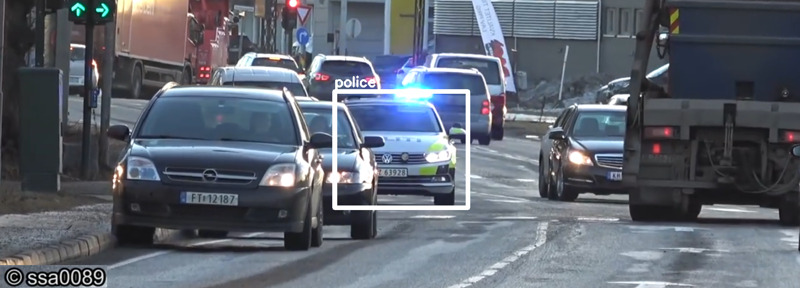

<!------>
<!------>
# Darkflow Police Car Detection


<!---A computer vision model for police car detection.--->

# 1. Darkflow
The Darkflow is the implementation of [YOLO](https://pjreddie.com/darknet/yolo/) (originally written in C) in Python/TensorFlow. For a detailed overview of Darkflow the reader is encouraged to check the Darkflow [github](https://github.com/thtrieu/darkflow) repository where the installtion process along with other useful information can be found. For a short instruction on Darkflow installtion please read section 1.1. For the rest of this tutorial it is assumed that the user is working on a linux system.

## 1.1 Darkflow Installation
According to Darkflow [page](https://github.com/thtrieu/darkflow) there are three different ways to install Darkflow. In this tutorial we will follow the first method. First, you need to navigate to the Darkflow [page](https://github.com/thtrieu/darkflow). Next, click on the "clone or download" to download the entire repository as ".ZIP" file or use the url to clone the repository on your computer (you need to have ___git___ insalled on your computer). If zip method is used then unzip the contents of the file. After unziping the contents navigate to the "root" directory where the ___setup.py___ along with other files and directories(e.g. cfg directory) is located. On the command line (inside the root directory where the setup.py file is located) enter the following command (make sure you have python3 installed on your system):

>python3 setup.py build_ext --inplace

Depending on whether you have the necessary python packages on your system you may receive error messages! ___Cython___ and ___opencv-python___ are the two most likely packages that you may get error messages about. Make sure you have them installed and python has access to them. Once the setup.py has run successfully, you can test the Darkflow model by exceuting the following command in the root directory.

>flow --imgdir sample_img/ --model cfg/tiny-yolo.cfg --load bin/tiny-yolo.weights --gpu 1.0

___Flow___ is an executive command. Flow should be set in your computer's path (if it is not set by default). By executing the above line the Darkflow looks inside the ___sample_image___ directory for test images. Next, it uses ___tiny-yolo.cfg___ configuration file located inside ___cfg___ directory. Then, it takes the ___tiny-yolo.weights___ located inside ___bin___ directory. If your system has GPU installed on it and enabled it will run on gpu. If the model ran successfully you would be able to see the results inside ___out___ directory located in ___sample_image___.

## 1.2 Darkflow Configuration File
You can have access to several different configuration files inside ___cfg___ directory. There are several cfg files in the cfg directory each for a different YOLO flavor (including tiny-YOLO, YOLO-VOC, and YOLO; read this [page](https://pjreddie.com/darknet/yolo/) for a description of each flavor). Each cfg file contains the structure of the model along with the parameters for traianing that model (e.g. learning rate, decay rate, momentum). For training a model the cfg file and the path to the cfg file's location has to be given along with the --model flag (similar to the code above).

## 1.3 Darkflow Weights
Depending on the model you are planning to use the appropriate weight file needs to be downloaded from [this](https://drive.google.com/drive/folders/0B1tW_VtY7onidEwyQ2FtQVplWEU) google drive. (The same link can be accessed by navigating to the ___intro___ section of [this](https://pjreddie.com/darknet/yolo/) page.) Once the right weight file has downloaded put it inside the ___bin___ directory so the flow can access to it (e.g. bin/tiny-yolo.weights).

## 1.4 Darkflow Annotations, Classes
To create your annotation file you need to follow the YOLO annotation format which requires a ___.xml___ format. For the purpose of the car detection model [labelImg](https://github.com/tzutalin/labelImg) was used. LabelImg will allow you to store annotations and class names in both ___.txt___ and ___.xml___ formats.

[comment]: <> (# 1.5. Training Darkflow on a Custom Dataset)


# 2. Darkflow Car Detection
In order to train and run Darkflow on your own custom dataset, you need to have the required files and directories [Correct this part ]

- ___annotations___ directory
- ___bin___ directory
- ___built_graph___ directory
- ___cfg___ directory
- ___ckpt___ directory
- ___images___ directory
- ___labels.txt___ file 

## 2.1 Darkflow Car Detection File System
The following shows the structure of the Darkflow police car detection model:

```bash
root
|
|___ /annotations
|               |___ annotation.xml (your .xml files)
|
|___ /bin
|       |___ weight files (the original and renamed weight files)
|
|___ /built_graph
|              |___ .meta and .pb files
|
|___ /cfg
|      |___ .cfg files (the original and renamed one)
|
|___ /ckpt
|       |___ check point files will be stroed here
|
|___ /images
|         |___ your .png or .jpeg (place your training images here)
|
|___ labels.txt (here only police car label/class)

```
### 2.1.1 Annotaitons Directory
Where you keep the annotaions files. In case of this model there are as many .xml files as there are images of police cars. Each .xml file gives the coordinates of the ground truth box. For instance, example_01.xml files contains the coordiantes of the ground truth box around a police car in the image 01.

### 2.1.2 Bin Directory
Where you keep your weight files. Notice that the Darkflow requires you to provide it with two identical weight files with different file names. For examples if you are using tiny-yolo model, you have to keep the original name of the weight file that is ___yolov2-tiny-voc.weights___ while changing the name of the second weight file to something different (e.g. ___yolov2-tiny-c2.weights___). Please read the 5th part of the ___Training on your own dataset___ section [here](https://github.com/thtrieu/darkflow) for more details. 

### 2.2.3 CKPT Directory
This is the ___checkpoint___ directory. During the traingin session Darkflow will store a group of four different files inside this directory. This process happens repeatedly after a given number of epochs. An example is given below;

1- ___yolov2-tiny-voc_c2-250.data-00000-of-00001___ 

2- ___yolov2-tiny-voc_c2-250.index___

3- ___yolov2-tiny-voc_c2-250.meta___ 

4- ___yolov2-tiny-voc_c2-250.profile___

For the rest of this tutorial we need two of these files. First, the file with ___.data___ which contains the updated weights after 250 epochs. And the ___.meta___ file. See the ___Training new model___ section [here](https://github.com/thtrieu/darkflow) for further details on how to test your model from a given checkpoint. 

### 2.2.4 Built_graph Directory
Once the desired checkpoint has achived the following command has to be applied to convert the ___.data___ file to a ___protobuf file (.pb)___. The .pb file is the weight file that will be used in Jetson nano developer kit.

>flow --model cfg/yolo-new.cfg --load -1 --savepb

>flow --model cfg/yolo.cfg --load bin/yolo.weights --savepb

Remember that the ___.weight___ file in the command line above has to be replaced by desired ___.data___ file from the checkpoint (ckpt) directory. Please read the ___Save the built graph to a protobuf file (.pb)___ [here](https://github.com/thtrieu/darkflow) for more details.

### 2.2.5 cfg Directory
Put your configuration file inside this directory (e.g. yolov2-tiny-voc.cfg). There are two lines that need to be changed when it comes to training on custom datasets; number of ___classes___ and number of ___filters___. Before making any changes to the any files remember that, similar to the weight files, a copy of the desired configuration file with a different name needs to be made and placed in the cfg directory. For instance, one may decide to use the original ___yolov2-tiny-voc.cfg___ file. Then, one has to make another copy of the same file with a different name, e.g. ___yolov2-tiny-voc_c2.cfg___, and place it along with the original file in the cfg directory. Next, comes the filter and class changes. These changes need to be done to the ___renamed___ configuration file. At the end of the renamed file you can find both classes and filters parameters. Place the number of classes you are going to train your model on (in case of police car the original value is replaced with 1). However, for the numner of filters you have to follow the following equation;

> num * (classes + 5)

Where one has to replace ___num___ with 5 and classes with the number classes you are training on. For example, in case of Police car detection model the number of classes is 1 and num is 5 which according to the equation the number of filters becomes 5*6 = 30. Thus,  the original value of the filter in the renamed cfg file will be replaced with 30 (from 125 to 30). The user has to use the modified and renamed configuration file when training their model!  Please read ___Training on your own dataset___ section [here](https://github.com/thtrieu/darkflow) for more details.

### 2.2.6 Images Directory
This directory contains your training images (i.e. police car images).

### 2.2.7 labels.txt file
This file contains the label/class of the objects to be detected (i.e. police car)

## 2.3 Training and Inference
Once you have built the required file system and place the necessary files inside the correct directory you can run the following command to start traingin your model. 

>flow --model cfg/yolo-new.cfg --load bin/tiny-yolo.weights --train --gpu 1.0

The above line uses yolo-new configuration file along with tiny-yolo weights and runs on a GPU. For a complete list of manditory and optional flags type in the following command on the command line: ???????? [add the command]


# 3. Jetson Nano Developer Kit

## 3.1 Installation
You can find a good introduction on seting up your Jetson nano develper kit [here](https://developer.nvidia.com/embedded/learn/get-started-jetson-nano-devkit#intro), however, below you can find a very short summary of the steps you need to take to prepare your Jetson device.

1- You need to have a microSD card

2- Download ___Jetson Nano Developer Kit SD Card Image___ [here](https://developer.nvidia.com/jetson-nano-sd-card-image-r3223)

3- Write the image to your microSD card using [Etcher](https://www.balena.io/etcher/) (pick the one that suits your operating system)

4- After writing the image to your microSD card insert the card into your Jetson device

5- Power on and you are good to go!


## 3.2 Running Your Model on Jetson
The operating system on the Jetson is a linux operting system so to install the necessary python packages you can simply use the  ___pip___ command. Once you have the python packages installed you need to install Darkflow on Jetson following one of the three methods provided [here](https://github.com/thtrieu/darkflow#getting-started) (also described in [section 1.1 ](https://github.com/nozhanb/policeCar/blob/master/README.md#11-darkflow-installation)). However, this time you do need to create the same file system structure. This time you only need to have the ___built_graph___, and ___sample_img___ directories where you need to transfer the created ___.meta___ and ___.pb___ files from your local machine onto the Jetson and inside the ___built_graph___ directory. Your test images have to be stored inside the sample_img directory on the Jetson machine. Once you have install the Darkflow on Jetson and transfered the files and test images you can use the following command to make prediction on your test images. 

> flow --pbLoad built_graph/yolo.pb --metaLoad built_graph/yolo.meta --imgdir sample_img/

You can find and read more about the command above [here](https://github.com/thtrieu/darkflow#save-the-built-graph-to-a-protobuf-file-pb).

## 3.3 Real-Time Police Car Detection
In order to do real-time car detection you need to connect a usb camera to Jetson. It would be more convenient to install a camera software to enable Jetson to detect the camera. For the purpse of this work ___guvcview___ was used (you can use any softwares!). You can install it by simply typing;

> sudo apt-get install guvcview

Once you have this software installed and after connecting your usb camera, the camera should be detected by Jetson and a window should pop up on the screen showing the live camera (if the camera was not detected open the guvcview and try to find the camera from inside the gucview). Finally, to do real-time detection you need to type in the following command from inside the root directory of the Darkflow (where the built_graph and sample_img directories are located);

> flow --pbLoad built_graph/yolo.pb --metaLoad built_graph/yolo.meta --demo camera

Please read [this](https://github.com/thtrieu/darkflow#cameravideo-file-demo) section for more details.

# 4. Jetson Nano Developer Kit 40-Pin Expansion Header
In this section a general overview of the expansion header of the Jetson will be given. The expansion header will be used for sending signal to an LED.

## 4.1 Expansion Header's Pins
In order to send signal from Jetson to the LED one needs to knwo which pins on the expansion header to use. Generally, the pins on the expansion header fall into several different categories (e.g. ground, 5v constant power). For the purpose of this work we will be dealing with three different pins; GND (i.e. ground), 5V (constant power), and GPIO (i.e. general purpose input/output) pins. To have a better understanding of the location and the functionality of each pin read [this](https://pinout.xyz/pinout/uart#
) and [this](https://www.element14.com/community/community/designcenter/single-board-computers/blog/2019/05/21/nvidia-jetson-nano-developer-kit-pinout-and-diagrams). Note that the pin layout of the Jetson follows that of the Raspbery Pi. (The reader is encouraged to do more research on the similarity of the Raspberry pi's 3 and Jetson's expansion headers!) In order to interact with the pins (i.e. send/receive signals to/from the pins) one has to install the ___Jetson.GPIO___ library. To do so, run the following command;

> sudo pip install Jetson.GPIO

It is very likely that after importing the library you will get a ___permission___ error. In order to mitigate the error navigate to the ___/sys/class/gpio___ and change the permission of the ___export___ and ___unexport___ files from only write to both read and write for all users (use sudo chmod 666 export and the same for unexport). To test whether things work correctly type in the following command on the command line in a terminal and hit enter;

> GPIO.getmode()

It should print out either ___10___ or ___11___ or other values. Here, 10 means GPIO.BOARD and 11 means GPIO.BCM. Check [this](https://stackoverflow.com/questions/31687465/gpio-getmode-in-python-on-raspberry-pi-gets-different-value-than-on-wiki/31688886#31688886) for further details on what each value means. After installing the Jetson.GPIO library follow the instructions [here](https://github.com/NVIDIA/jetson-gpio#setting-user-permissions) under the ___Setting User Permissions section___. You need to create a new group, add your username to the group and copy a ___.rules___ file to the given path in the ___/etc/udev/rules.d/___ (see the instructions). Finally, you need to restart the Jetson so the permissions take effect. If you do not follow the instructions one has to change all the file permissions manually. You will save yourself time by following the instructions on permissions!

Note that there are four types of mode to be set but the two modes that are relavent to this work are ___BOARD___ and ___CBM___. Depending on the mode you are in, pins can be accessed by their original numbers (written next to each pin on the header) or non-origianl numbers. Setting mode to ___BOARD___ you should use pin numbering on the board (e.g. 12 for pin 12) while setting mode to ___CBM___ requires gpio numbering (e.g. 79 for pin 12). Read [this](read [this](https://github.com/NVIDIA/jetson-gpio#2-pin-numbering) for more details) for further details.


## 4.2 Bread Board Layout
The image below shows the layout of the bread board. 

<!------>


Initially, the gpio 12 was used (on Jetson's expansion header) but it did not work (I am not sure why)! Instead, pin 16 was used as the gpio pin (try different pins and see which ones work)!

### 4.2.1 Resistor and LED

In order to make the LED work you need to add the right resistor to the circut. A resistor with high value will not let enough current pass through the circut and the LED will remain off while a resistor with too little resistance will damage the LED as the current that will reach the LED will be more than what it can take. For the purpose of this work a resistor with $135 k\Omega$ resistance was used. Note that in the image above you can see the color bands on the resistor which indicate the resistance of the resistor. Also, the legs of the LED are of different lengh with longer one beign positive (not always the case)! So one must place the LED in the bread board correctly. You can find more details on LEDs andpicking the right resistor [here](https://www.westfloridacomponents.com/blog/led-basics-how-to-tell-which-lead-is-positive-or-negative/) and [here](https://www.evilmadscientist.com/2012/resistors-for-leds/). 

## 4.3 Darkflow and GPIO Pins

As the end goal is to send a signal to the LED once a police car is detected one has to make some changes to the Darkflow's ___predict.py___ file. This file is responisble for creating a bounding box around the detected object (here the police car). For the purpose of this work we add a few lines of code to this file so everytime the code tries to draw a bounding around the police car it, also, send a signal to the ondicated pin. The path to this file is given below;

> /usr/local/lib/python3.6/dist-packages/darkflow/net/yolov2/predict.py)


When I turned the videoplayer on and clicked on the play button the led would turn on! And when clicked on the pause button the led would turn off after a few second! And this process can be repeated as many times as you click on the play button. I am not sure why there is a connection between pin 12 and the videoplayer!? I set the pin 12 as an output inside the predict.py file (/usr/local/lib/python3.6/dist-packages/darkflow/net/yolov2/predict.py)!?. ! This needs to fixed!!!

# Useful Links
https://developer.nvidia.com/embedded/learn/get-started-jetson-nano-devkit

https://www.element14.com/community/community/designcenter/single-board-computers/blog/2019/05/21/nvidia-jetson-nano-developer-kit-pinout-and-diagrams

https://pinout.xyz/pinout/uart#

